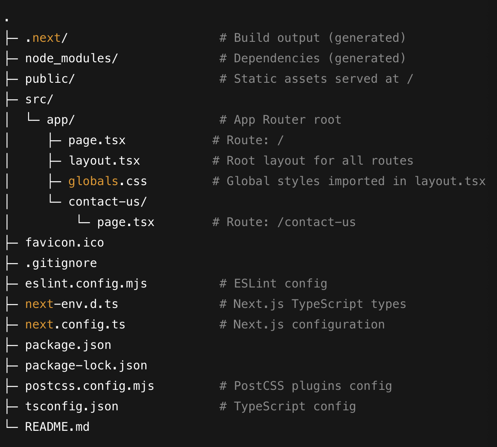

# Club-Guppy Next.js

A minimal Next.js project using the App Router, TypeScript, and Tailwind-ready configs. This README explanis how to install dependencies, run the app, and understand the folder layout.

## Requirements
- Node.js 18.18+ or 20+
- npm 9+ (or pnpm/yarn)

## Getting Started

1) Install Deps
` npm install `

2) Start the development server `npm run dev`

3) Navigate to http://localhost:3000

## Project Structure

## Learn More

- Next.js Docs: https://nextjs.org/docs
